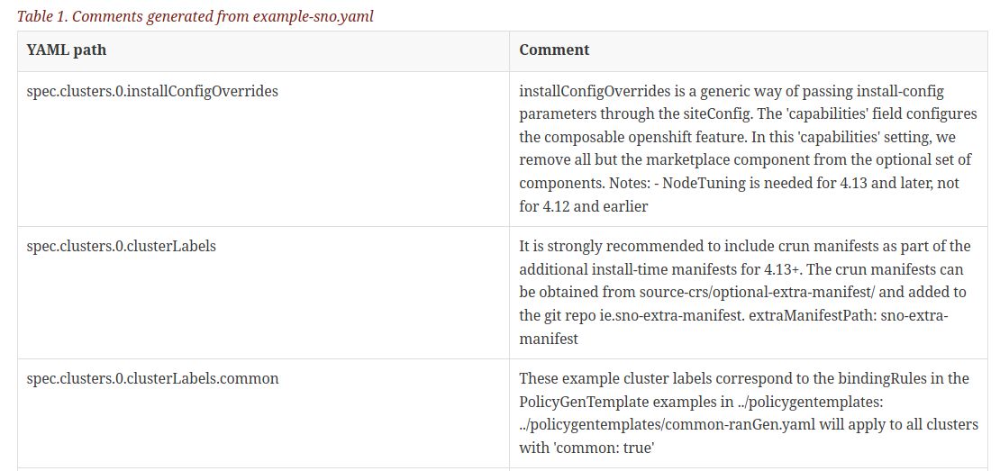

# Generate AsciiDoc tables of extracted YAML comment strings

Extract YAML comments into CSV and include the CSV as tables in AsciiDoc

1. Install `yq`
2. Point `yq` at some YAML and generate a CSV file of YAML paths and comments
3. Generate some AsciiDoc

## Running the script

Point the script at a YAML file:

```cmd
$ extract-yaml-comments.sh example-sno.yaml
```

Generate the output csv as an AsciiDoc table:

```asciidoc
[id="example-sno"]
= Comments generated from example-sno.yaml

.Comments generated from example-sno.yaml
[cols="1,3", options="header", format=csv]
|====
include::example-sno.csv[]
|====
```

## Example generated output



[siteconfig/example-sno.yaml](https://github.com/openshift-kni/cnf-features-deploy/blob/release-4.13/ztp/gitops-subscriptions/argocd/example/siteconfig/example-sno.yaml) > https://file.emea.redhat.com/aireilly/example-sno.html